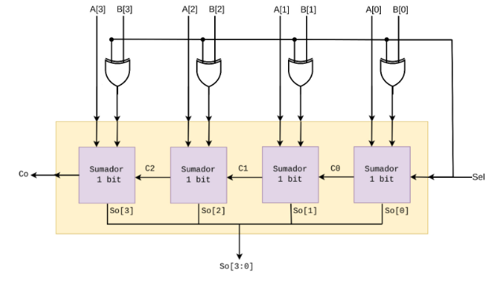
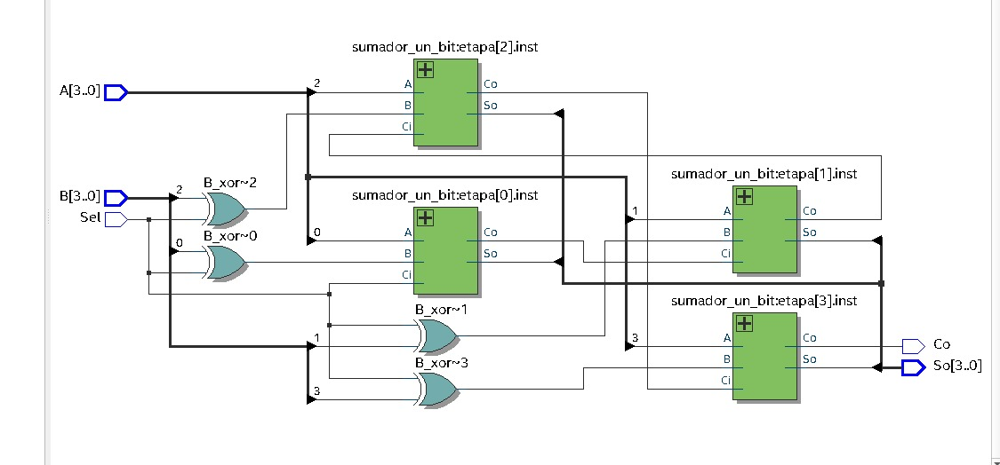
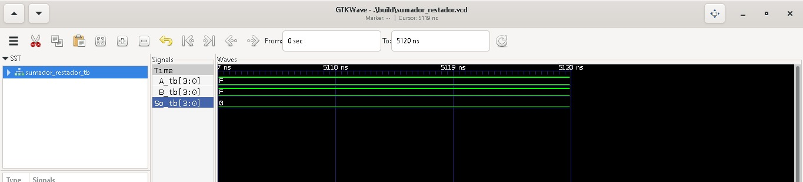

# Lab02 - Sumador/Restador de 4 bits

# Integrantes
1). Cristian Camilo Cifuentes Rodriguez. 130005

2). Paula Natalia Roa García. 137653

# Informe

Indice:

1. [Documentación](#documentación-de-los-circuitos-implementados-implementado)
2. [Simulaciones](#simulaciones)
3. [Evidencias de implementación](#evidencias-de-implementación)
4. [Preguntas](#preguntas)
5. [Conclusiones](#conclusiones)

## Documentación del diseño implementado

### 1. Sumador/Restador

#### 1.1 Descripción

Este documento presenta el diseño, implementación y validación de un circuito sumador/restador de 4 bits. El diseño se destaca por la optimización de hardware, ya que reutiliza la arquitectura de un sumador completo añadiendo compuertas lógicas XOR y una señal de control. Mediante la aplicación del teorema de complemento a 2, el circuito es capaz de transformar las operaciones de resta en sumas, permitiendo manejar números positivos y negativos en binario. El informe detalla la fundamentación teórica, describe la estructura del circuito a nivel de hardware y documenta las simulaciones realizadas para verificar su correcto funcionamiento antes de su implementación física.

En el diseño de sistemas digitales, realizar operaciones aritméticas con números negativos requiere de una representación eficiente que no implique duplicar el hardware para cada operación. Este laboratorio tiene como objetivo principal implementar un circuito restador utilizando la lógica de complemento a 2, lo cual nos permite reutilizar un sumador de 4 bits existente para realizar también operaciones de resta. 

El uso del complemento a 2 simplifica el diseño del circuito al convertir la resta $A - B$ en una suma equivalente $A + (\sim B + 1)$, donde $\sim B$ es la inversión bit a bit. A través de este laboratorio, aprenderemos a adaptar arquitecturas base mediante señales de control y a verificar y validar rigurosamente el diseño en un entorno de simulación, un paso crucial para identificar y corregir errores de lógica antes de proceder con el despliegue en hardware real.
#### 1.2 Diagramas
A continuación se muestra el circuito del complemento a 2:

## Simulaciones 

### 1. Simulación del sumador/restador

#### 1.1 Descripción
El circuito sumador/restador de 4 bits basa su funcionamiento en la capacidad de ejecutar tanto la suma como la resta matemática utilizando el mismo bloque sumador principal. Esto se logra interpretando la resta mediante la aritmética de complemento a 2.

**Fundamento Matemático (Complemento a 2)**
Para restar un número $B$ de un número $A$, aplicamos la siguiente transformación:
$$A - B = A + (\sim B + 1)$$
Para hallar el complemento a 2 de un número, se siguen dos pasos:
1. **Inversión de bits (Complemento a 1):** Se invierten todos los bits del sustraendo. Por ejemplo, si $B = 0101_2$ (5 en decimal), su inversión será $1010_2$.
2. **Sumar 1:** Se le suma un 1 al resultado anterior. Siguiendo el ejemplo: $1010_2 + 1 = 1011_2$. Este resultado final ($1011_2$) representa el número $-5$ en complemento a 2.

Al sumar este valor con el minuendo, digamos $A = 0111_2$ (7 en decimal), obtenemos:
$$0111_2 + 1011_2 = 10010_2$$
Descartando el bit más significativo (acarreo o MSB), el resultado es $0010_2$, que equivale a 2 en decimal, confirmando que $7 - 5 = 2$.

**Implementación a nivel de Hardware**
Para llevar esta lógica al circuito, se utiliza una señal de control denominada $Sel$ y compuertas lógicas XOR acopladas a las entradas del operando $B$.

* **Modo Suma ($Sel = 0$):** Las compuertas XOR dejan pasar los bits del operando $B$ sin modificaciones. Como el acarreo inicial del primer sumador ($Cin$) está conectado a la señal $Sel$, este recibe un 0. El circuito realiza la operación estándar $A + B$.
* **Modo Resta ($Sel = 1$):** La señal en alto hace que las compuertas XOR actúen como inversores lógicos, obteniendo el complemento a 1 del operando $B$ (Paso 1). Simultáneamente, la señal $Sel = 1$ ingresa como acarreo inicial ($Cin$) en el primer bloque sumador, sumando un 1 al número invertido (Paso 2). De esta forma, se consolida el complemento a 2 y el bloque sumador principal ejecuta la operación $A + (\sim B + 1)$, es decir, $A - B$.

Adicionalmente, el bit de acarreo de salida final ($Co$) sirve como indicador del signo del resultado en operaciones de resta: si $Co = 1$, el resultado es positivo; si $Co = 0$, el resultado es negativo y se encuentra expresado en complemento a 2.
#### 1.2 Imagen Simulacíon:

### 3. EXplicación codigo 

Módulo 1: Sumador Completo de 1 Bit (sumador_un_bit)
Este primer código describe el hardware a nivel de compuertas lógicas (nivel estructural) de un sumador completo de un solo bit.

Define el inicio del módulo y su nombre.
👉 [Ver línea](https://github.com/digital-ECCI/lab02-arquitectura-g1-e5/blob/main/sumador_un_bit.v#L1)

Declara el primer bit a sumar
👉 [Ver línea](https://github.com/digital-ECCI/lab02-arquitectura-g1-e5/blob/main/sumador_un_bit.v#L2)
Declara el segundo bit a sumar

👉 [Ver línea](https://github.com/digital-ECCI/lab02-arquitectura-g1-e5/blob/main/sumador_un_bit.v#L3)

Declara el acarreo de entrada (Carry in), proveniente de una suma anterior.
👉 [Ver línea](https://github.com/digital-ECCI/lab02-arquitectura-g1-e5/blob/main/sumador_un_bit.v#L4)

Declara la salida del resultado de la suma.
👉 [Ver línea](https://github.com/digital-ECCI/lab02-arquitectura-g1-e5/blob/main/sumador_un_bit.v#L5)

Declara el acarreo de salida (Carry out), que se generará si la suma excede la capacidad de 1 bit
👉 [Ver línea](https://github.com/digital-ECCI/lab02-arquitectura-g1-e5/blob/main/sumador_un_bit.v#L6)

Cierra la declaración de los puertos.
👉 [Ver línea](https://github.com/digital-ECCI/lab02-arquitectura-g1-e5/blob/main/sumador_un_bit.v#L7)

Declaración de conexiones internas (Cables)

Cable para almacenar la primera parte de la suma (A ⊕ B).
👉 [Ver línea](https://github.com/digital-ECCI/lab02-arquitectura-g1-e5/blob/main/sumador_un_bit.v#L9)

Cable intermedio para el cálculo del acarreo final.
👉 [Ver línea](https://github.com/digital-ECCI/lab02-arquitectura-g1-e5/blob/main/sumador_un_bit.v#L10)

Otro cable intermedio para el cálculo del acarreo final.
👉 [Ver línea](https://github.com/digital-ECCI/lab02-arquitectura-g1-e5/blob/main/sumador_un_bit.v#L11)

Instancia una compuerta XOR. Las entradas son A y B, y su salida se conecta al cable x_ab.
👉 [Ver línea](https://github.com/digital-ECCI/lab02-arquitectura-g1-e5/blob/main/sumador_un_bit.v#L13)

Instancia una segunda compuerta XOR para obtener la suma final. Sus entradas son x_ab y Ci, y su salida es el puerto So.
👉 [Ver línea](https://github.com/digital-ECCI/lab02-arquitectura-g1-e5/blob/main/sumador_un_bit.v#L14)

Instancia una compuerta AND. Sus entradas son x_ab y Ci, saliendo por cout_t.
👉 [Ver línea](https://github.com/digital-ECCI/lab02-arquitectura-g1-e5/blob/main/sumador_un_bit.v#L15)

Instancia otra compuerta AND. Sus entradas son A y B, saliendo por a_ab.
👉 [Ver línea](https://github.com/digital-ECCI/lab02-arquitectura-g1-e5/blob/main/sumador_un_bit.v#L16)

Instancia una compuerta OR para determinar si hubo acarreo en alguna de las etapas anteriores. Sus entradas son cout_t y a_ab, y su salida final es el puerto Co.
👉 [Ver línea](https://github.com/digital-ECCI/lab02-arquitectura-g1-e5/blob/main/sumador_un_bit.v#L17)

Indica el final del módulo.
👉 [Ver línea](https://github.com/digital-ECCI/lab02-arquitectura-g1-e5/blob/main/sumador_un_bit.v#L19)

* **Módulo 2: Sumador/Restador de 4 Bits (sumador_restador_4_bits):**
Este código es de un nivel de abstracción superior. Utiliza el sumador de 1 bit que creaste arriba para replicarlo 4 veces y, mediante el método aritmético de Complemento a 2, logra sumar o restar dependiendo de un selector.

Es una directiva del compilador que inserta el código del módulo anterior aquí para poder usarlo.
👉 [Ver línea](https://github.com/digital-ECCI/lab02-arquitectura-g1-e5/blob/main/sumador_restador_4_bits.v#L2)

Inicia la declaración del módulo principal.
👉 [Ver línea](https://github.com/digital-ECCI/lab02-arquitectura-g1-e5/blob/main/sumador_restador_4_bits.v#L4)

Entrada A (4 bits)
👉 [Ver línea](https://github.com/digital-ECCI/lab02-arquitectura-g1-e5/blob/main/sumador_restador_4_bits.v#L5)

4 cables para el operando B.
👉 [Ver línea](https://github.com/digital-ECCI/lab02-arquitectura-g1-e5/blob/main/sumador_restador_4_bits.v#L6)

Bit que define la operación (0 = Suma, 1 = Resta).
👉 [Ver línea](https://github.com/digital-ECCI/lab02-arquitectura-g1-e5/blob/main/sumador_restador_4_bits.v#L7)

El resultado de 4 bits de la operación.
👉 [Ver línea](https://github.com/digital-ECCI/lab02-arquitectura-g1-e5/blob/main/sumador_restador_4_bits.v#L8)

Bit extra que funciona como acarreo o indicador de signo.
👉 [Ver línea](https://github.com/digital-ECCI/lab02-arquitectura-g1-e5/blob/main/sumador_restador_4_bits.v#L9)

Cierra la declaración.
👉 [Ver línea](https://github.com/digital-ECCI/lab02-arquitectura-g1-e5/blob/main/sumador_restador_4_bits.v#L10)

***variables internas**

entradade 5 cables para propagar los acarreos. Empieza en el acarreo de entrada inicial (c[0]) y termina en el acarreo final (c[4]).
👉 [Ver línea](https://github.com/digital-ECCI/lab02-arquitectura-g1-e5/blob/main/sumador_restador_4_bits.v#L12)

entrada de 4 cables que contendrá el valor de B modificado (ya sea B normal o B invertido).
👉 [Ver línea](https://github.com/digital-ECCI/lab02-arquitectura-g1-e5/blob/main/sumador_restador_4_bits.v#L13)

Asigna el valor del selector al acarreo de entrada del primer sumador. Si es resta (Sel=1), inyecta un 1, cumpliendo el paso de "sumar 1" del complemento a 2.
👉 [Ver línea](https://github.com/digital-ECCI/lab02-arquitectura-g1-e5/blob/main/sumador_restador_4_bits.v#L17)

Declara una variable especial de tiempo de compilación para iterar.
👉 [Ver línea](https://github.com/digital-ECCI/lab02-arquitectura-g1-e5/blob/main/sumador_restador_4_bits.v#L20)

Abre el bloque de generación de hardware.
👉 [Ver línea](https://github.com/digital-ECCI/lab02-arquitectura-g1-e5/blob/main/sumador_restador_4_bits.v#L21)

Inicia un bucle que se repetirá 4 veces (de la posición 0 a la 3). El nombre : etapa es una etiqueta obligatoria para el bloque.
👉 [Ver línea](https://github.com/digital-ECCI/lab02-arquitectura-g1-e5/blob/main/sumador_restador_4_bits.v#L22)

Esta es la clave de la inversión. Usa una compuerta XOR. Si Sel es 0, B no cambia. Si Sel es 1, invierte el bit de B (cumpliendo el paso de "invertir los bits" del complemento a 2).
👉 [Ver línea](https://github.com/digital-ECCI/lab02-arquitectura-g1-e5/blob/main/sumador_restador_4_bits.v#L25)

Llama al módulo que definimos al principio (se crea un "clon" llamado inst).
👉 [Ver línea](https://github.com/digital-ECCI/lab02-arquitectura-g1-e5/blob/main/sumador_restador_4_bits.v#L28)

Conecta el bit actual de A a la entrada A del sumador.
👉 [Ver línea](https://github.com/digital-ECCI/lab02-arquitectura-g1-e5/blob/main/sumador_restador_4_bits.v#L29)

Conecta el bit modificado de B a la entrada B del sumador.
👉 [Ver línea](https://github.com/digital-ECCI/lab02-arquitectura-g1-e5/blob/main/sumador_restador_4_bits.v#L30)

Conecta el acarreo que entra a esta etapa.
👉 [Ver línea](https://github.com/digital-ECCI/lab02-arquitectura-g1-e5/blob/main/sumador_restador_4_bits.v#L31)

Conecta el resultado de esta etapa a la salida final.
👉 [Ver línea](https://github.com/digital-ECCI/lab02-arquitectura-g1-e5/blob/main/sumador_restador_4_bits.v#L32)

Propaga el acarreo resultante al cable de la siguiente etapa.
👉 [Ver línea](https://github.com/digital-ECCI/lab02-arquitectura-g1-e5/blob/main/sumador_restador_4_bits.v#L33)

Cierra la instanciación.
👉 [Ver línea](https://github.com/digital-ECCI/lab02-arquitectura-g1-e5/blob/main/sumador_restador_4_bits.v#L34)

Cierra el bucle for.
👉 [Ver línea](https://github.com/digital-ECCI/lab02-arquitectura-g1-e5/blob/main/sumador_restador_4_bits.v#L35)

Cierra el bloque de generación de hardware.
👉 [Ver línea](https://github.com/digital-ECCI/lab02-arquitectura-g1-e5/blob/main/sumador_restador_4_bits.v#L36)

El último acarreo generado por el bit más significativo se conecta a la salida general del módulo.
👉 [Ver línea](https://github.com/digital-ECCI/lab02-arquitectura-g1-e5/blob/main/sumador_restador_4_bits.v#L39)

Finaliza el módulo.
👉 [Ver línea](https://github.com/digital-ECCI/lab02-arquitectura-g1-e5/blob/main/sumador_restador_4_bits.v#L41)

## Evidencias de implementación

<video width="360" height="360" controls>
  <source src="./sumador_restador.mp4" type="video/mp4">
  Tu navegador no soporta el elemento <code>video</code>.
</video>

Para validar el funcionamiento del diseño en hardware, se implementó el circuito sumador/restador de 4 bits en una tarjeta FPGA. En el video de evidencia adjunto, se realiza una prueba de escritorio ejecutando una operación de resta.

**Caso de prueba documentado:**
Se configuró el circuito para resolver la operación $3 - 7$.
* **Minuendo (A):** Se ingresó el valor $3$, configurando los interruptores en $0011_2$.
* **Sustraendo (B):** Se ingresó el valor $7$, configurando los interruptores en $0111_2$.
* **Selector (Sel):** Se activó en $1$ para habilitar el modo resta (complemento a 2).

**Análisis del resultado:**
Los LEDs de salida arrojaron el valor $1100_2$. Adicionalmente, se evidenció que el LED correspondiente al acarreo de salida ($Co$) permaneció apagado ($Co = 0$), lo cual es el indicador de que el resultado de la operación es negativo. 

Al interpretar el valor obtenido ($1100_2$) bajo la norma de complemento a 2, se confirma que este binario corresponde al número decimal $-4$. Esto demuestra que la tarjeta FPGA calculó exitosamente la operación, ya que $3 - 7 = -4$.

## Conclusiones
**Optimización de hardware:** La implementación del circuito sumador/restador de 4 bits demostró de manera exitosa la viabilidad y eficiencia de reutilizar componentes lógicos en el diseño de arquitecturas digitales. Mediante la integración de compuertas XOR y una única señal de control ($Sel$), se logró expandir la funcionalidad de un bloque sumador estándar para incluir operaciones de resta, evitando la necesidad de construir un circuito aritmético independiente y optimizando los recursos del sistema.
* **Validación práctica del complemento a 2:** El desarrollo de este laboratorio permitió comprobar a nivel de hardware el fundamento matemático del complemento a 2. El diseño logró ejecutar de forma precisa operaciones de resta al transformarlas en sumas equivalentes mediante la lógica $A - B = A + (\sim B + 1)$. Se validó que el uso de la señal $Sel$ para invertir el sustraendo y simultáneamente inyectar un 1 en el acarreo inicial ($Cin$) es un enfoque robusto y funcional.
* **Interpretación de resultados y signo:** Se verificó de forma concluyente que el acarreo de salida ($Co$) del último bloque sumador actúa eficazmente como indicador de estado para la operación. El diseño respondió adecuadamente a la teoría, confirmando que cuando $Co = 1$ en una resta, el resultado es positivo; mientras que si $Co = 0$, el circuito entrega correctamente un resultado negativo codificado en formato de complemento a 2.

**Formato IEEE:**
* [1] digital-ECCI, "Arquitectura-de-procesadores - Laboratorio 2: Sumador/Restador", GitHub, Repositorio oficial del curso. [En línea]. Disponible en: https://github.com/digital-ECCI/Arquitectura-de-procesadores/blob/main/labs/02_lab02/README.md
